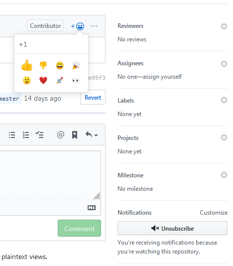

# Contribution guidelines

## Merge locks
You can contribute to merge locks in two ways.

### Creating a merge lock
+ Make sure there is no pull request for the merge lock that you want to create
+ Only create a merge lock for an entry from the `merge-preventions.md` file
+ Check if the entries you want to create a merge lock for, should be merged together
+ Don't create PRs for multiple merge locks at once. Create a single PR for each merge lock
+ Create a PR (see example PRs [#25](https://github.com/manami-project/anime-offline-database/pull/25) and [#24](https://github.com/manami-project/anime-offline-database/pull/24))
  + Pull the latest revision
  + Title of the PR/commit must look like this: `Merge lock URL` where URL is the affected anime. E.g.: If the entry in the merge-preventions.md is `.... Not merging [https://anilist.co/anime/6868] into...` Then the PR/commit should be named `Merge lock https://anilist.co/anime/6868`
  + Remove the entry from the `merge-preventions.md`
  + Add a new entry in the merge-locks.json

### Validate a merge lock PR
You can help by validating whether or not the PR for a merge lock is valid.

+ Open a PR and check out the anime entries. If you think that the PR is valid, give the PR a +1. Don't hesitate to check a PR which already got a +1. The more thumbs up a PR has, the faster it will be merged, because your validation saves me time.
+ If the merge lock does not seem to be valid just add a -1.

## Possible errors / problems in the database
If you find something that, in your opinion, should be changed, please submit an issue rather than creating a pull request, because the database is created by an automated process.

## Adding your project to the list of projects using this database
In case you have a project that uses this database and you want to add it to the list of projects that are using this database, create a pull request adding it to the table. Do not create an issue asking me or anyone else to add it.

+ You have to be the author/maintainer of the project that you want to add
+ Create a PR in which you add it to the table in the README.md
+ Do not change/alter anything else
+ Your project has to use this database
+ You have to have a link back to this project in the README.md of your project
+ The README.md of your project has to be in english or it must have an english translation
+ Your project has to be hosted either on github or gitlab
+ The table is sorted by project name (ascending). Add your entry accordingly.
+ Project name must match the repository name and link directly to the source code (not a project page such as YOURNAME.github.io)
+ Put your name under _Author/Maintainer_ with a link to your profile.
+ Add a meaningful description in english. The description must not be longer than 150 characters.

## Anything else
Create an issue.